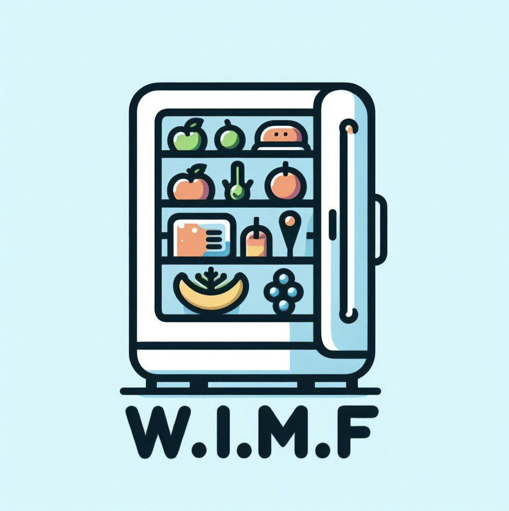

# What's In My Fridge (W.I.M.F)

  

W.I.M.F è un'applicazione Android progettata per aiutarti a monitorare gli alimenti presenti in casa, tenere traccia delle date di scadenza e ridurre lo spreco alimentare.

## 📌 Funzionalità principali

- **Autenticazione con Firebase**: Accesso tramite Google o email.
- **Gestione delle unità di conservazione**: Aggiunta, modifica ed eliminazione di frigoriferi e congelatori.
- **Monitoraggio degli alimenti**: Inserimento, aggiornamento e rimozione dei prodotti con ordinamento per data di scadenza.
- **Scansione dei codici a barre**: Riconoscimento automatico degli alimenti tramite database autoapprendente.
- **Notifiche di scadenza**: Avvisi automatici per i prodotti in scadenza entro 24 ore.
- **Interfaccia intuitiva**: Design semplificato con codice colore per evidenziare le date di scadenza.

## 🗄️ Struttura del Database

- **DB Utenti**: Ogni utente ha una raccolta personale contenente i propri frigoriferi e prodotti.
- **DB Codici a Barre**: Contiene i codici a barre riconosciuti con il nome associato.

## 🔜 Sviluppi futuri

- **Miglioramento grafico**: Interfaccia più accattivante e intuitiva.
- **Frigoriferi condivisi**: Possibilità di gestire alimenti con più utenti.
- **Lista della spesa integrata**: Collegata direttamente ai prodotti disponibili.
- **Collaborazione con supermercati**: Integrazione per ordini e consegne.
